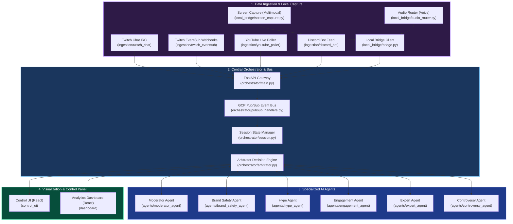

# 🎙️ Stream-Agents: Autonomous Multi-Agent Livestream Orchestration Framework

Stream-Agents is a production-ready, distributed, multi-agent AI orchestration framework designed for modern livestream platforms (Twitch, YouTube, Discord). It empowers content creators and brands with cooperative, real-time AI agents that handle everything from chat moderation and brand safety to interactive hype events, viewer engagement, live visual feedback, and technical question-answering.

Built with **FastAPI**, **Google Cloud Pub/Sub**, and state-of-the-art **Gemini Multimodal Models**, this repository provides a highly scalable architecture to ingest real-time data feeds, route them to specialized agents, arbitrate conflicting agent actions, and output clean insights to a developer dashboard and stream control UI.

---

## 🏗️ System Architecture

The following diagram illustrates the flow of real-time data from ingestion bots and the streamer's local desktop, through the FastAPI gateway, down to specialized AI agents, and out to the management UIs:



---

## 🤖 Meet the Agents

The framework utilizes six distinct, cooperative AI agents. Each agent subscribes to specific event envelopes (e.g., chat messages, donation alerts, milestones, and screen frames) and proposes targeted actions to the central **Arbitrator**:

### 1. 🛡️ Moderator Agent (`agents/moderator_agent`)
* **Role**: Primary frontline defender of the livestream.
* **Responsibilities**: Filters profanity, blocks link spam, detects toxic behavior, and enforces streamer-defined rules. It can trigger instant chat blocks, warning messages, or slow-mode configurations.

### 2. 🔏 Brand Safety Agent (`agents/brand_safety_agent`)
* **Role**: Corporate and brand protection.
* **Responsibilities**: Monitors both live chat and streamer activity (via multimodal screen frames and audio transcripts) to flag copyright concerns, inappropriate topics, or trademark issues. Crucial for sponsored livestreams and brand integrations.

### 3. 📈 Hype Agent (`agents/hype_agent`)
* **Role**: Community catalyst and booster.
* **Responsibilities**: Watches for high-frequency events (e.g., subscription trains, donation bursts, raid alerts, milestones) and coordinates real-time celebrations. It can trigger visual alerts, chat emotes, sound effects, or custom channel rewards.

### 4. 🤝 Engagement Agent (`agents/engagement_agent`)
* **Role**: Audience builder and retention strategist.
* **Responsibilities**: Suggests dynamic polls, Q&A topics, streamer call-to-actions, and chat talking-points. Analyzes highlight-worthy moments to suggest clips or social media recaps.

### 5. 🎓 Expert Agent (`agents/expert_agent`)
* **Role**: Domain-specific knowledge base.
* **Responsibilities**: Acts as a smart assistant during gameplay or educational streams. Evaluates complex viewer inquiries, retrieves facts or guides, and formulates precise answers.

### 6. ⚔️ Controversy Agent (`agents/controversy_agent`)
* **Role**: Context-aware sentiment and debate manager.
* **Responsibilities**: Detects polarizing debates, flame wars, or highly controversial discussions. Helps the moderator agent assess whether to let a heated debate continue or to cool it down.

---

## 📁 Repository Structure

```bash
stream-agents/
├── agents/                      # 🤖 Specialized AI Agents
│   ├── brand_safety_agent/
│   ├── controversy_agent/
│   ├── engagement_agent/
│   ├── expert_agent/
│   ├── hype_agent/
│   ├── moderator_agent/
│   └── shared/                  # Common schemas & tool definitions
├── control_ui/                  # 🎛️ React + Vite UI to control and toggle agents
├── dashboard/                   # 📊 React + Vite Dashboard to visualize live metrics
├── infra/                       # 🛠️ GCP & Kubernetes deployment scripts
├── ingestion/                   # 🔌 Multi-platform Ingestion Connectors
│   ├── discord_bot/             # Discord event listener
│   ├── twitch_chat/             # Twitch IRC connector
│   ├── twitch_eventsub/         # Twitch webhook listener
│   └── youtube_poller/          # YouTube API poller
├── local_bridge/                # 🌉 Local Streaming PC client bridge
│   ├── audio_router.py          # Routing system sound
│   ├── screen_capture.py        # Real-time frame capture
│   └── bridge.py                # Desktop websocket sync
└── orchestrator/                # 🧠 Core Backend Gateway & Arbitrator
```

---

## 🚀 Getting Started

### 📋 Prerequisites
* **Python 3.12+**
* **Node.js 18+**
* **Google Cloud SDK** (For Pub/Sub routing)

### 1. Start the Central Orchestrator
Install the dependencies and run the FastAPI server:
```bash
cd stream-agents/orchestrator
pip install -r requirements.txt
uvicorn main:app --reload --port 8080
```

### 2. Configure Ingestion Bots
Each crawler/poller in the `ingestion/` folder comes equipped with its own container configuration. For local testing, navigate to the target crawler and install dependencies:
```bash
cd stream-agents/ingestion/twitch_chat
pip install -r requirements.txt
python main.py
```

### 3. Run the Local Bridge Client
If you are streaming on the same machine, run the desktop capture and audio routing script to sync your video/audio feeds to the orchestrator:
```bash
cd stream-agents/local_bridge
pip install -r requirements.txt
python bridge.py
```

### 4. Start the Dashboards
Launch the Vite development servers for your dashboards:
```bash
# Start the Control UI
cd stream-agents/control_ui
npm install && npm run dev

# Start the Analytics Dashboard
cd stream-agents/dashboard
npm install && npm run dev
```

---

## 📄 License
This project is licensed under the permissible **MIT License** - see the [LICENSE](LICENSE) file for details.
